### Locally Linear Embedding and Laplacian Eigenmap
#### A simple implementation of LLE
##### Algorithm Description
- The algorithm could be roughly divided into two steps. 
    - $find\_invariance()$ aims at determining the reconstruction weights for each data point.
    - $embedding()$ aims at determining the optimized low-dimensional representation for each data point based on the same reconstruction weights.
```PYTHON
    def analyze(self):
        self.find_invariance()
        self.embedding()
```
- $find\_invariance()$
```PYTHON
    def find_invariance(self):
        self.K = int(input("Number of nearest neighbors: "))
        # sparse matrix for embedding
        self.W = np.zeros((self.N, self.N))
        # for the ball tree, [N, D]
        tree = BallTree(self.X)
        for i in range(self.N):
            # gram matrix
            bold_x = np.zeros((self.D, self.K))
            neighbors = np.zeros((self.D, self.K))
            unit = np.ones((self.K, 1))
            dist, ind = tree.query([self.X[i]], k=self.K + 1)
            for j in range(self.K):
                bold_x[:,j] = self.X[i]
                neighbors[:,j] = self.X[ind[0][j+1]]
            diff = bold_x - neighbors
            gram_matrix = np.dot(np.transpose(diff), diff)
            pinv_g = np.linalg.pinv(gram_matrix)
            weights = np.dot(pinv_g, unit) / np.dot(np.dot(unit.T, pinv_g), unit)
            # one to one
            for j in range(self.K):
                self.W[i][ind[0][j+1]] = weights[j]
```
- $embedding()$
```PYTHON
    def embedding(self):
        I = np.eye(self.N, dtype=int)
        target = np.dot(I - self.W, np.transpose(I - self.W))
        eigenvalues, eigenvectors = np.linalg.eig(target)
        eig_seq = np.argsort(eigenvalues)
        #discard the first eigenvalue
        eig_seq_indice_2d = eig_seq[1:3]
        eig_seq_indice_3d = eig_seq[1:4]
        new_eig_vec_2d = eigenvectors[eig_seq_indice_2d]
        new_eig_vec_3d = eigenvectors[eig_seq_indice_3d]
        plt.figure(1)
        plt.subplot(211)
        plt.scatter(new_eig_vec_2d[0].real, new_eig_vec_2d[1].real, edgecolors='white', alpha=0.5, c='b')
        plt.title("d=2")
        ax = plt.figure().add_subplot(212, projection='3d')
        ax.scatter(new_eig_vec_3d[0].real, new_eig_vec_3d[1].real, new_eig_vec_3d[2].real)
        plt.title("d=3")
        plt.show()
```
##### Results
- The following result is based on the first part of the Iris flower dataset, in which four properties of the same kind of flower, setosa, are listed.
    - $N=1284$， $D=62500$， $K=3$， $d=2$
    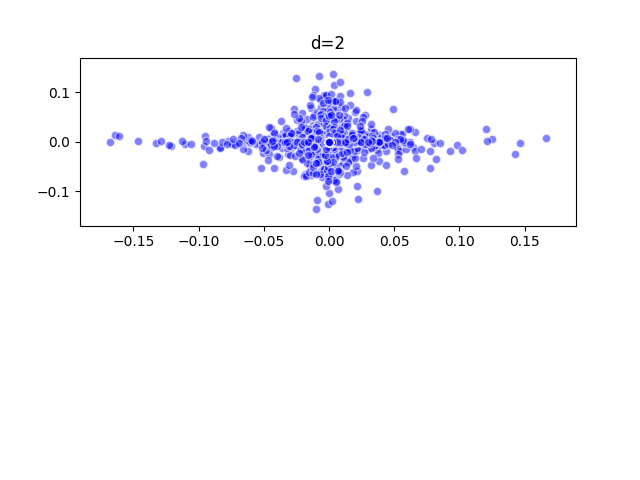
    - $N=1284$, $D=62500$, $K=3$, $d=3$
    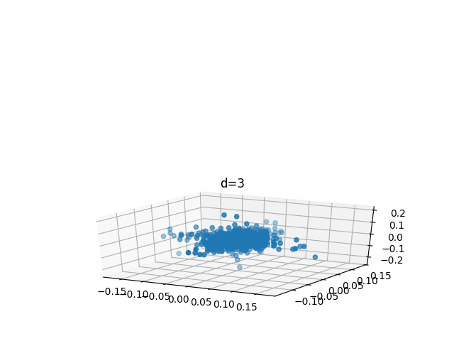
    - $N=1284$, $D=62500$, $K=4$, $d=2$
    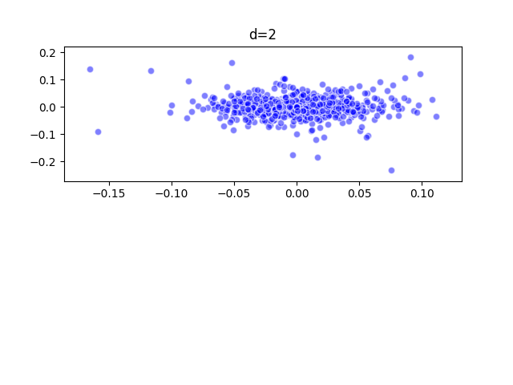
    - $N=1284$, $D=62500$, $K=4$, $d=3$
    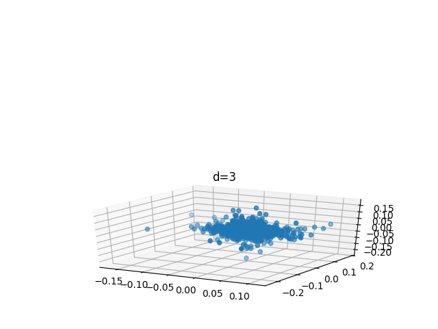
    - $N=1284$, $D=62500$, $K=5$, $d=2$
    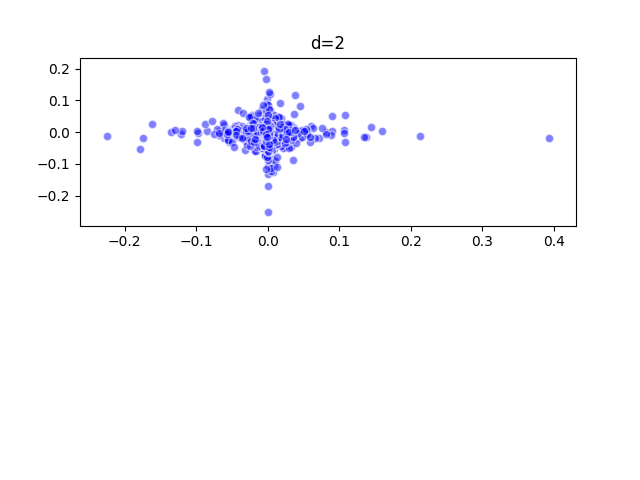
    - $N=1284$, $D=62500$, $K=5$, $d=3$
    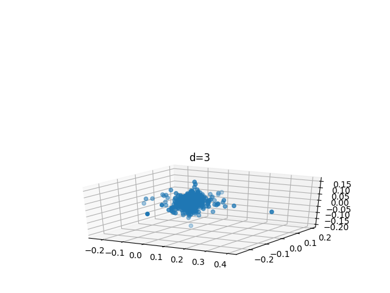
    - $N=1284$, $D=62500$, $K=6$, $d=2$
    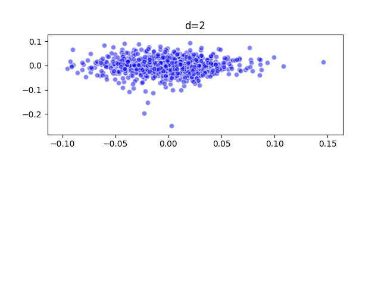
    - $N=1284$, $D=62500$, $K=6$, $d=3$
    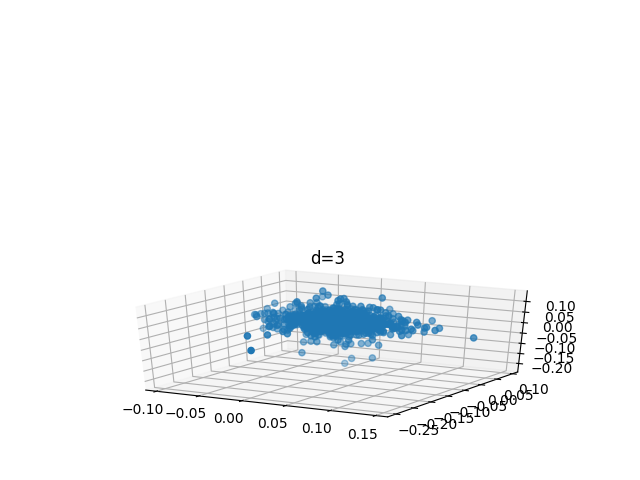
    - $N=1284$, $D=62500$, $K=7$, $d=2$
    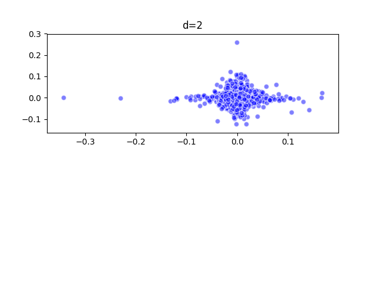
    - $N=1284$, $D=62500$, $K=7$, $d=3$
    
    - $N=1284$, $D=62500$, $K=100$, $d=2$
    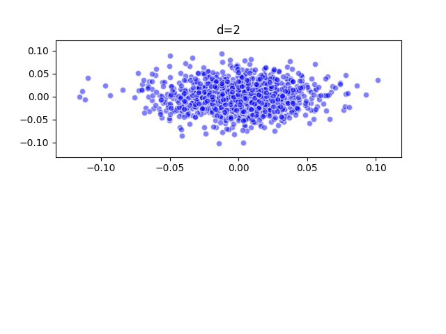
    - $N=1284$, $D=62500$, $K=100$, $d=3$
    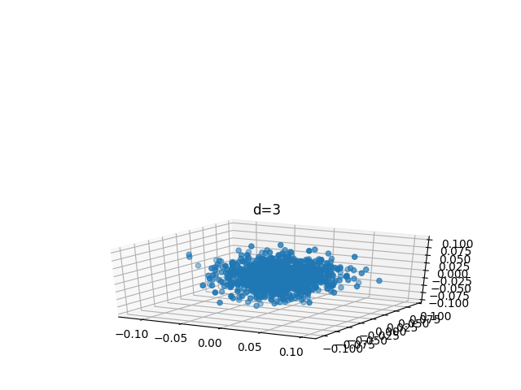
    - $N=1284$, $D=62500$, $K=1000$, $d=2$
    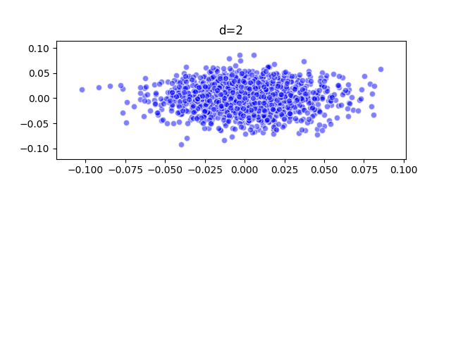
    - $N=1284$, $D=62500$, $K=1000$, $d=3$
    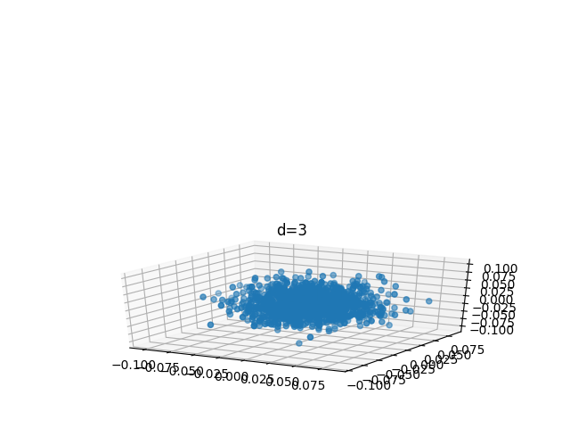
- Note that when $K\geq4$, the number of nearest neighbours will be bigger than the number of dimensions, in this case, the gram matrix must be conditioned by adding a small multiple of the identity matrix.
#### The definition of manifold
- In my own words : something **invariant**.
- In Wikipedia's words : *In mathematics, a manifold is a topological space that locally resembles Euclidean space near each point. More precisely, each point of an n-dimensional has a neighbourhood that is homeomorphic to the Euclidean space of dimension n.*

#### Why manifold learning could achieve nonlinear dimension reduction?
- Because in general, manifold learning unravels the underlying low-dimensional embeddings of the globally nonlinear input data by focusing on the locally euclidean components. By selecting the K nearest neighbours, the different locally euclidean components are somehow **connected as a graph**, and in this way, manifold learning is then capable of achieving nonlinear dimension reduction.

#### What means Locally, Linear and Embedding?
- *Locally* : only focusing on each separate data point, and finding its K nearst neighbours.
- *Linear* : for each local topological space spanned around each data point and its K nearst neighbours, it's euclidean(linear), therefore, the data point could be linearly reconstructed by its K nearst neighbours.
- *Embedding* : the same weights that reconstruct a specific data point in the original D dimensional space should be equally valid in the lower d dimensional space.

#### What is the assumption adopted in these three steps?
- The manifold is well sampled. In other words, all the data points together formed a proper manifold.
- The topological space spanned by a data point and its K nearest neighbours is euclidean. 
- *We imagine that there exists a linear mapping consisting of a translation, rotation, and rescaling that maps the high dimensional coordinates of each neighborhood to global internal coordinates on the manifold.* (Saul & Roweis, 2003)

#### What is the local consistency proposed and used by LLE/LE? And why could be?
- **Locally euclidean**
- The data point is drawn from a manifold. Therefore, based on the definition of manifold, it's definitely possible to find a locally euclidean subspace.

#### What is the key (key idea) of LLE/LE? In one sentence
- **Whitney Embedding Theorem** : Any smooth real m-dimensional manifold (required also to be Hausdorff and second-countable) can be smoothly embedded in the real 2m-space ($R^{2m}$), if $m > 0$.

#### Could LLE/LE address multiple subspace dimension reduction?
- **Of course.** Manifold learning focuses on the local configuration of the input data. Therefore, the number of subspaces doesn't matter at all.

#### Advantages and disadvantages of LLE/LE
- **Advantages** : **LLE/LE** could solve nonlinear dimension reduction problems. Therefore, it is applicable in various scenarios. In addition, the implementation of LLE/LE is quite straightforward.
- **Disadvantages** : The advantage of manifold learning is the same as its disadvantage. The concept of manifold has given us convenience, but it also introduces a certain amount of ambiguity. It's hard to determine whether all the data points have formed a proper manifold. Without a well-sampled manifold, all the conclusions and calculation would mean nothing.

#### Could PCA learn a manifold? What is the difference among PCA, CCA, LDA, LLE, and LE? Compare the objective function of PCA, CCA, LDA, LLE, and LE, and summarize their difference and similarity?
- PCA is able to learn a globally euclidean manifold.
- Briefly, the evolutional relations between all the listed dimensionality-reduction methods are : 
    - **Linear(Euclidean) space** : 
        - *PCA(Principal Component Analysis)* : *computes the **linear projections** of **greatest variance** from the top **eigenvectors** of the data **covariance matrix*** (Saul & Roweis, 2003)
        $$arg\max_{w} \ w^TSw$$
        $$ s.t. \ ||w||=1$$
        where $S$ signifies the covariance matrix of the input data
            - *CCA(Canonical Correlation Analysis)* : compared with *PCA*,also computes the linear projections of greatest variance from the top eigenvectors of the data covariance matrix between **multiple subspaces**, therefore, it is **weakly supervised**.
            $$ arg\max_{w_1...w_n} \sum_{i=1}^n\sum_{j=1}^nw_i^TC_{ij}w_j$$
            $$ s.t. \sum_{i=1}^nw_i^TC_{ii}w_i=1$$
            where $C_{ij}$ signifies the covariance matrix between the $i_{th}$ and $j_{th}$ view
            - *LDA(Linear Discriminant Analysis)* : compared with *PCA*,
            learns a weight matrix for **maximum class-separation**, such that the within-class data points are as close as possible, and the between-class data points are as far as possible. Therefore, it is **strongly supervised**。
            $$arg\max_W \  Tr\{(WS_WW^T)^{-1}(WS_BW^T)\} $$
            where $S_B$ signifies the **between-class scatter matrix**
            $S_W$ signifies the **within-class scatter matrix**
        - Apparently, the objective functions listed above look quite similar with each other. 
            - They are all explicitly or implicitly based on the concept of **covariances**. Essentially, these dimensionality-reduction methods rely on the metrics defined by the covariances. The fact that the solution to all these object functions is based on eigenvalue decomposition also implies the notion of covariance. 
            - The differences between these objective function lie in their own specific formulation of the problem. 
                - For example, *CCA* extended *PCA* from one subspace to multiple subspaces, therefore, the objective function is also extended to the calculation on the covariance matrix between different subspaces.
                - Two sets of standards need to be satisfied in *LDA*, so two terms relevant to covariances are put forward.
    - **Nonlinear space(manifold)** :
        - *LLE(Locally Linear Embedding)* : *computes a low dimensional embedding with the property that nearby points in the high dimensional space remain nearby and similarly co-located with respect to one another in the low dimensional space.* (Saul & Roweis, 2003)
            - objective function of the "linear" step: aims at the **invariance : linear reconstruction weights**
            $$ min_W||x_i-\sum^k_{j=1}W_{ij}D_{ij}||_2^2$$
            $$ s.t. \ \sum_{j=1}^kW_{ij}=1$$
            where $x_i$ signifies the $i_{th}$ data point 
            $D_{ij}$ signifies the $j_{th}$ nearest neighbour of the $i_{th}$ data point
            - objective function of the "embedding" step : aims at the **low-dimensional representation** for each data point
            $$ min_Y ||Y-YW||_F^2$$
            $$ s.t. \ Y^TY=I$$
            where $W$ remains unchanged from the "linear" step
            and $Y$ signifies the low-dimensional representation
        - *LE(Laplacian Eigenmap)* : *LE* and *LLE* are based on the same idea described by the **Whitney Embedding Theorem** mentioned above. Their biggest difference lies in the second step that tries to **determine the local invariance, the weights.** 
            - In the "locally" step, they both find K nearest neighbots for each data points.
            - In the "linear" step, *LLE* optimizes the reconstruction weights based on a mean-squared error form, while *LE* defines a similarity graph via a Gaussian similarity metrics.
            - In the "embedding" step, *LLE* optimizes the low dimensional representation based on a mean-squared error form again, while *LE* chooses an object function based on differential geometry.
